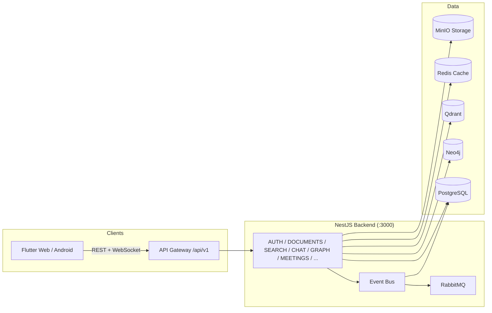

# AI Knowledge Graph for Organizations — Architecture Overview

> Enterprise AI-powered organizational knowledge engine. This document is the entry point
> into the architecture; detailed specifications live in [`docs/`](docs/).

## What this is

A SaaS platform that ingests an organization's documents, meetings, connectors and policies,
indexes them in a **PostgreSQL** relational store, a **Neo4j** knowledge graph and a
**Qdrant** vector database, and then provides AI-powered search, chat, expertise discovery,
knowledge-gap analysis and recommendations through a NestJS API and a Flutter frontend.

## Repository layout

```
.
├── backend/                 # NestJS 11 API (TypeScript, strict)
│   ├── src/
│   │   ├── modules/         # Feature modules (auth, documents, chat, search, ...)
│   │   ├── infrastructure/  # Global infra (Prisma, Neo4j, Qdrant, Redis, MinIO, ...)
│   │   ├── presentation/    # Guards, interceptors, filters, health
│   │   ├── shared/          # Decorators, constants, interfaces
│   │   └── domain/          # DDD entities (AggregateRoot)
│   ├── prisma/              # Schema, migrations, seed
│   └── test/                # e2e suites (Jest + Supertest)
├── frontend/                # Flutter 3.35 app (Android + Web)
│   └── lib/
│       ├── core/            # API client, routing, theme, shell
│       └── features/        # Feature-first modules (auth, chat, search, graph, ...)
├── docker/                  # docker-compose stack (13 services)
├── k8s/                     # Kubernetes manifests
├── scripts/                 # setup.ps1
├── tests/                   # (shared test assets — suites live in backend/test, frontend/test)
├── docs/                    # Full documentation suite (see below)
└── .github/workflows/       # CI
```

## Documentation index

| Area | Document |
|---|---|
| Product | [`docs/specifications/PROJECT_SPEC.md`](docs/specifications/PROJECT_SPEC.md) |
| System architecture | [`docs/specifications/ARCHITECTURE_SPEC.md`](docs/specifications/ARCHITECTURE_SPEC.md) |
| Databases | [`docs/specifications/DATABASE_SPEC.md`](docs/specifications/DATABASE_SPEC.md) |
| AI architecture | [`docs/specifications/AI_ARCHITECTURE.md`](docs/specifications/AI_ARCHITECTURE.md) |
| API design + OpenAPI | [`docs/specifications/API_SPEC.md`](docs/specifications/API_SPEC.md), [`docs/api/openapi.json`](docs/api/openapi.json) |
| Frontend | [`docs/specifications/FRONTEND_SPEC.md`](docs/specifications/FRONTEND_SPEC.md) |
| Backend | [`docs/specifications/BACKEND_SPEC.md`](docs/specifications/BACKEND_SPEC.md) |
| Security | [`docs/specifications/SECURITY_SPEC.md`](docs/specifications/SECURITY_SPEC.md) |
| DevOps | [`docs/specifications/DEVOPS_SPEC.md`](docs/specifications/DEVOPS_SPEC.md), [`docs/deployment-guide.md`](docs/deployment-guide.md) |
| Testing | [`docs/specifications/TESTING_SPEC.md`](docs/specifications/TESTING_SPEC.md) |
| UI/UX design system | [`docs/specifications/DESIGN_SYSTEM.md`](docs/specifications/DESIGN_SYSTEM.md) |
| Coding standards | [`docs/specifications/CODING_STANDARD.md`](docs/specifications/CODING_STANDARD.md) |
| Decisions (ADRs) | [`docs/architecture/adrs/`](docs/architecture/adrs/) |
| Roadmap | [`ROADMAP.md`](ROADMAP.md) |

## High-level system view



## Core technology stack

| Layer | Technology |
|---|---|
| Frontend | Flutter 3.35, Riverpod, GoRouter, Dio |
| Backend | NestJS 11, TypeScript (strict), Prisma 6 |
| Databases | PostgreSQL 16 (relational), Neo4j (graph), Qdrant (vectors) |
| Cache / Queue | Redis, RabbitMQ |
| Storage | MinIO (S3-compatible) |
| AI | OpenAI embeddings + chat completions |
| Observability | Prometheus metrics, winston logging |
| CI/CD | GitHub Actions, Docker, Kubernetes manifests |

## Key architectural decisions (summary)

- **Single deployable NestJS monolith** with clear module boundaries — deliberately not microservices (see [ADR-001](docs/architecture/adrs/0001-monolith-first.md)).
- **Polyglot persistence**: PostgreSQL = source of truth; Neo4j = knowledge graph; Qdrant = embeddings. Qdrant holds the *primary* vector index; the Postgres `Chunk` table is the canonical chunk store.
- **Resilient infrastructure**: Neo4j, Qdrant, Redis and OpenAI fail *soft* at boot (warn + degrade) so the API can start with only PostgreSQL available. Prisma/PostgreSQL is the only hard dependency.
- **Graceful degradation in the API**: features report disabled state and return partial results instead of crashing.
- **JWT auth per controller** via `JwtAuthGuard` + `RolesGuard` (RBAC: `ADMIN` / `USER` / `VIEWER`).
- **Unified response envelope**: `{ success, data | message, timestamp }` for every endpoint.

## Status

Implemented and verified: 16 controllers / ~60 REST endpoints, WebSocket chat gateway,
full Prisma schema with migration, seeded demo data, 23 e2e tests + 28 unit tests passing,
Flutter app (login/register, chat, search, graph explorer) building for Web and Android.
See [ROADMAP.md](ROADMAP.md) for what comes next.
