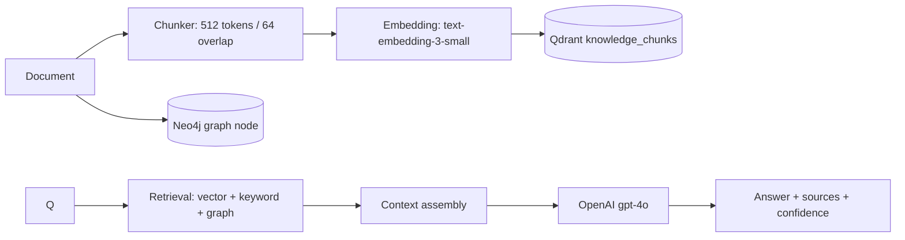

# AI Architecture

## 1. RAG pipeline

- **Chunking**: `CHUNK_SIZE = 512` tokens, `CHUNK_OVERLAP = 64` (constants in
  `src/shared/constants`; used by `DocumentsService.chunkDocument`).
- **Embeddings**: OpenAI `text-embedding-3-small`, dimension 1536
  (`EMBEDDING_DIMENSION`). Batch generation sorted by index.
- **Fallback embeddings**: if the API key is missing or the call fails, a deterministic
  hashed pseudo-embedding (normalized) is produced so the pipeline stays testable and
  demoable offline (ADR-005).
- **Vector store**: Qdrant collection `knowledge_chunks`, cosine distance,
  payload = `{ documentId, chunkIndex, organizationId, content }`.

## 2. GraphRAG strategy

Knowledge graph (Neo4j) is both an *index* and a *retrieval source*:

- Documents are mirrored as graph nodes (`Document` type).
- Auto-extracted entity nodes (`Person | Project | Technology | Service | API | Product`)
  are created during document processing (`entity_<docId>_auto`).
- **Retrieval**: `graphSearch` (searchNodes by name/title) contributes results to the
  hybrid pipeline; chat uses graph context in parallel with vector + keyword.
- **Subgraph traversal**: `getSubgraph(id, depth)` via `apoc.path.subgraphAll` powers the
  Graph Explorer UI.

## 3. Retrieval pipeline (chat)

`ChatService.sendMessage` retrieves from three sources in parallel:

1. **Vector**: embed query → Qdrant search (`knowledge_chunks`, top-k).
2. **Graph**: Neo4j `searchNodes`.
3. **Keyword**: Postgres ILIKE over documents.

Results are merged, deduplicated, and passed to the LLM as context with the user
question; the response includes `sources` (citations) and `confidence`.

## 4. Prompt design

- System prompt: organizational knowledge assistant; answer only from provided context;
  say when information is missing; cite sources.
- Chat completions: `OPENAI_MODEL` (default `gpt-4o`), temperature 0.3,
  `max_tokens` 1024.
- WebSocket gateway streams token deltas (`message:token`) and a final
  `{ done, sources, content }`.

## 5. Citation strategy

- `Message.sources Json?` stores the source list (documents/entities with identifiers and
  scores) per assistant message.
- Chat REST response and the final WS message both return `sources`.
- `SearchService` results carry `searchType` (`keyword | semantic | graph`) and scores —
  surfacing provenance in the UI.

## 6. Hallucination mitigation

| Control | Where |
|---|---|
| Grounding: answer from retrieved context only | Chat prompts |
| Confidence scoring on messages | `Message.confidence`; low-confidence paths emit `AI_CONFIDENCE_LOW` notifications (enum exists) |
| Sources/citations on every answer | `Message.sources`, chat responses |
| Explicit "not found" behavior | Prompt instructs declining when context is insufficient |
| Deterministic fallback embeddings (no silent fake vectors) | EmbeddingService logs error + uses fallback |

## 7. Model routing

- Embeddings: `text-embedding-3-small` (cost-optimized).
- Chat: `gpt-4o` (quality) with temperature 0.3.
- Single routing seam: `EmbeddingService` + `ChatService`/`ChatGateway` read model from env
  (`EMBEDDING_MODEL`, `OPENAI_MODEL`) — adding a router is a config change.

## 8. AI evaluation

- Unit tests stub OpenAI (via property-define mock) — e.g. `chat.service.spec.ts`,
  `recommendations.service.spec.ts` (Qdrant + embeddings mocked).
- E2E suite mocks embeddings and Qdrant to assert retrieval contracts without network.
- Planned: golden-set evaluation (Q&A pairs) and hallucination checks in
  `TESTING_SPEC.md`; k6 for retrieval latency.

## 9. Data privacy

- No document content is sent to the LLM beyond retrieved chunk context.
- Credentials for connectors never enter prompts.
- `data.organizationId` filter on all vector searches enforces tenant isolation.
