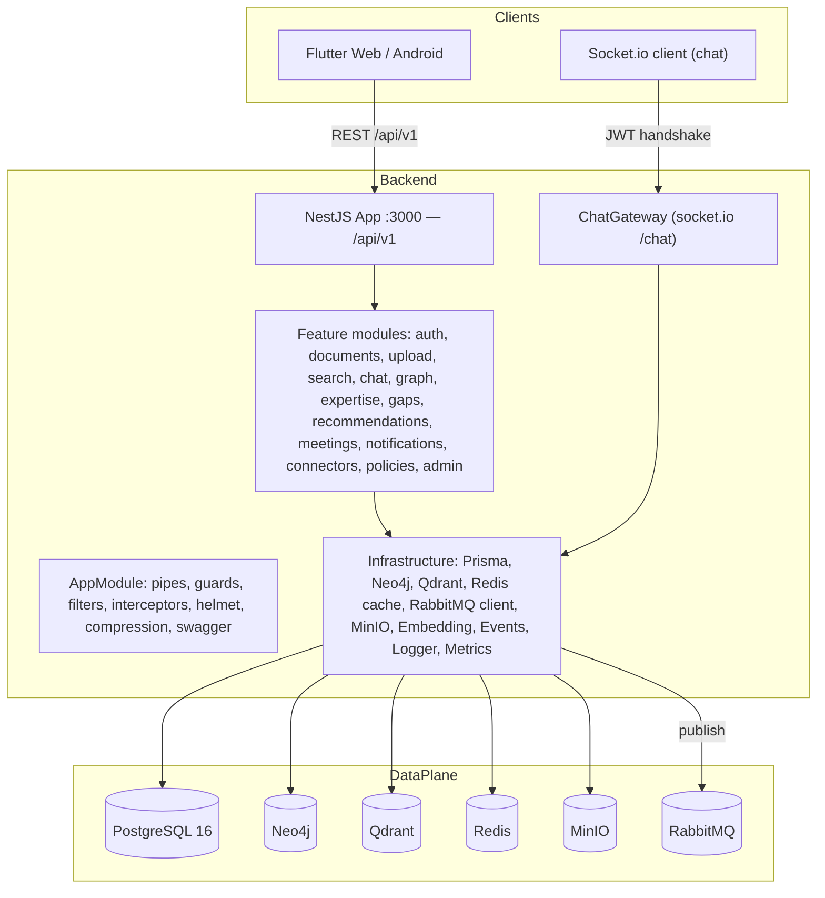
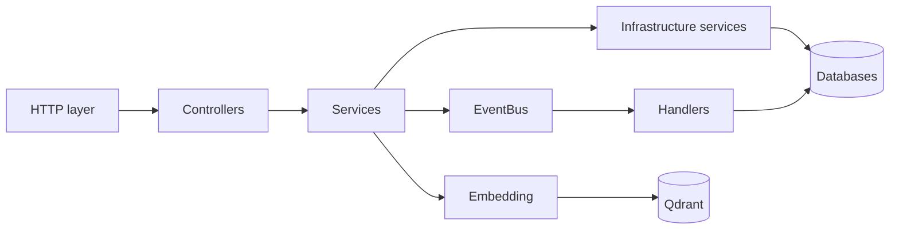
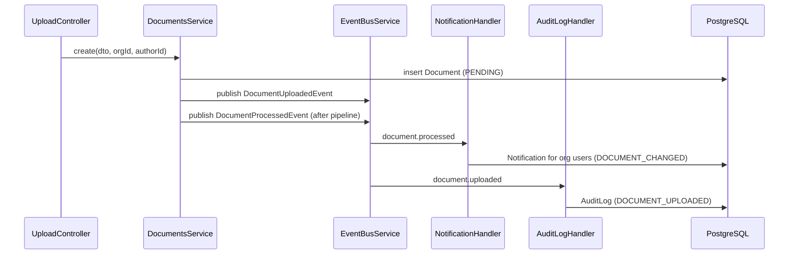
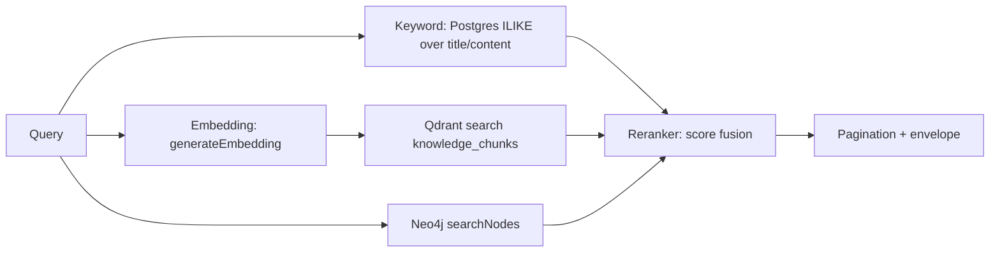
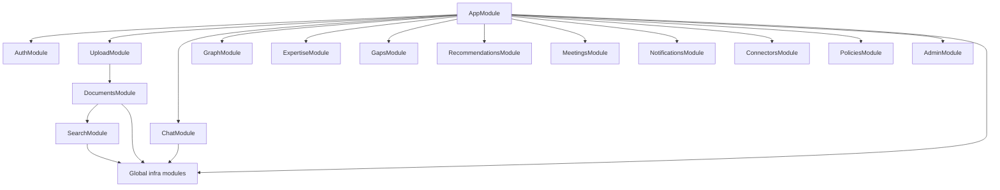

# Architecture Specification

## 1. High-level architecture

Single deployable **NestJS 11** monolith (TypeScript, strict) with a **Flutter** frontend,
polyglot persistence and queue-ready messaging. Deliberate monolith-first choice:
[ADR-001](docs/architecture/adrs/0001-monolith-first.md).

## 2. Layer responsibilities (Clean Architecture alignment)

| Layer | Location | Responsibility |
|---|---|---|
| Domain | `src/domain/` | `AggregateRoot` entities (`User`, `Organization`, `Document`, `Connector`) + enums |
| Infrastructure | `src/infrastructure/` | Framework adapters: DB, graph, vectors, cache, queue, storage, AI, events, logging, metrics |
| Modules | `src/modules/` | Use-case orchestration: controllers + services + DTOs (feature-first) |
| Presentation | `src/presentation/` | Cross-cutting HTTP: guards, interceptors, filters, health controller |
| Shared | `src/shared/` | Decorators (`@Public`, `@Roles`, `@CurrentUser`), constants, response interfaces |

**Dependency rule**: modules depend on infrastructure (via DI interfaces); infrastructure
never depends on modules. Domain entities are independent of Nest.

## 3. Service boundaries

Not microservices — module boundaries inside one process. Each `src/modules/*` module owns
its tables (through Prisma models) and its API surface. `SearchModule`, `ChatModule`,
`RecommendationsModule`, `ExpertiseModule`, `GapsModule` share Qdrant `knowledge_chunks`
and Neo4j — the single shared *collection contract*.

## 4. Microservice readiness

- **RabbitMQ client** already wired via `ClientsModule` (`RABBITMQ_CLIENT`,
  queue `knowledge-graph-queue`, durable) — event publishing can be moved off-process.
- **Domain events** (`EventBusService`) are the seam: handlers (`AuditLogHandler`,
  `NotificationHandler`) could become consumers without touching services.
- Services are DI-constructed, stateless (except pools) → horizontally scalable.
- Caveat: `ChatGateway` state is per-connection (no in-memory shared state) → safe.

## 5. Communication patterns

| Pattern | Where |
|---|---|
| Synchronous REST | Controllers ↔ services (all CRUD) |
| WebSocket events | ChatGateway: `message:send`, `message:token` streaming, `conversation:*` |
| In-process events | EventBus (EventEmitter2): `document.uploaded`, `document.processed`, `document.deleted`, `connector.sync.*`, `message.sent`, `policy.updated`, `meeting.created` |
| Message queue | RabbitMQ client registered (outbox-ready) |

## 6. Event flow

## 7. Data flow — hybrid search

## 8. Dependency graph (modules)

All feature modules resolve infrastructure through the `@Global()` modules:
Database, Neo4j, Vector, Cache, Queue, Storage, AI, Events, Logger, Metrics,
ConnectorRegistry.

## 9. Tenancy model

Every tenant table carries `organizationId`; all service queries filter by it
(e.g. `documents.findMany({ where: { organizationId, deletedAt: null } })`).
JWT carries `orgId`; `JwtStrategy` re-validates the user and organization on every request.

## 10. Resilience & failure modes

| Dependency | On boot | On request | Degradation |
|---|---|---|---|
| PostgreSQL | **hard** (`$connect`) | hard | API won't start without DB |
| Neo4j | soft (verifyConnectivity try/catch) | per-request error | graph features disabled; services catch + fallback |
| Qdrant | soft (ensureCollection try/catch) | per-request error | semantic search disabled |
| Redis | soft (fallback to in-memory Keyv) | cache miss | caching degrades to local |
| RabbitMQ | none (lazy) | publish error | events lost if not retried |
| MinIO | none (client only) | per-request error | storage features error |
| OpenAI | soft (missing key → fallback embeddings) | fallback embeddings | embeddings deterministic fallback |

This pattern (ADR-004) keeps the demo/dev experience honest: **the API runs with only
PostgreSQL and reports exactly which features are degraded** (see warnings at boot).
