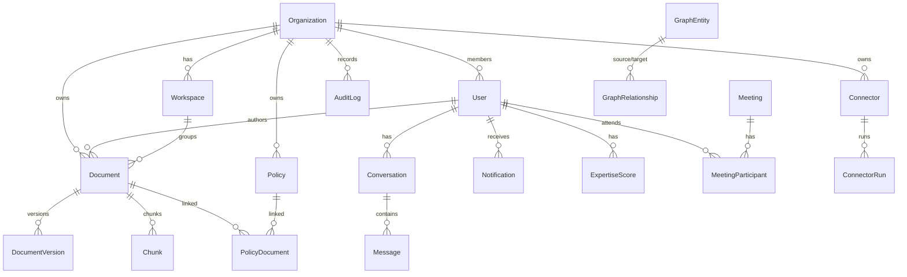
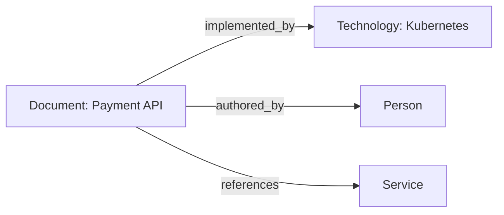

# Database Specification

## Overview

Three storage engines with clear responsibilities:

| Engine | Role | Access |
|---|---|---|
| PostgreSQL 16 | System of record (users, orgs, docs, chunks, meetings, policies, audit) | Prisma 6 |
| Neo4j 5 | Knowledge graph (entities + relationships) | neo4j-driver |
| Qdrant | Vector index for semantic search | @qdrant/js-client-rest |
| Redis | Cache (optional; in-memory fallback) | cache-manager-redis-yet |

## PostgreSQL (Prisma)

- Generator: `prisma-client-js`; datasource `postgresql`, `DATABASE_URL` (required).
- Migrations: `prisma/migrations/20260801220749_init` (config via `prisma.config.ts`).
- Seed: `prisma/seed.ts` (ts-node) — demo org/users/documents/chunks/meeting/policy.

### Connection pooling (PgBouncer)

- Runtime connections go through **PgBouncer in transaction mode** (compose service
  `pgbouncer`, host port 6432): the API never opens more than `connection_limit=9`
  Prisma connections per instance (`pool_timeout=10`, `pgbouncer=true` URL params),
  with `DEFAULT_POOL_SIZE=20` / `MAX_CLIENT_CONN=200` on the pooler.
- **Migrations must NOT run through PgBouncer** — `prisma migrate deploy` targets
  Postgres directly (`postgres:5432`) because transaction-mode pooling breaks DDL
  transactions; CI and release jobs use the direct URL.
- Slow-query observability: `PrismaService` logs any query exceeding
  `SLOW_QUERY_MS` (default 500 ms) as a warning with the query target.

### Conventions

- PKs: `String @id @default(uuid())`.
- Timestamps: `createdAt` default `now()`; `updatedAt @updatedAt` where mutable; soft deletes via `deletedAt DateTime?` (documents, orgs, users, policies, connectors, meetings, workspaces).
- Enums used for domain state (`UserRole`, `DocumentStatus`, `ConnectorType`, ...).

### ER diagram (core models)



### Model inventory

| Model | Key fields | Notes |
|---|---|---|
| `Organization` | `name`, `slug @unique`, `domain?`, `settings Json` | tenant root |
| `User` | `email @unique`, `password String?`, `keycloakId @unique`, `organizationId`, `role UserRole`, `isActive` | password hashed bcrypt(12); keycloakId currently random UUID |
| `Workspace` | `name`, `organizationId`, `createdById` | |
| `Document` | `title`, `filePath`, `fileType`, `fileSize`, `checksum`, `status DocumentStatus`, `authorId?`, `organizationId`, `source DocumentSource`, `metadata Json`, `isIndexed`, `isEncrypted` | soft-delete |
| `DocumentVersion` | `documentId`, `version`, `filePath`, `checksum`, `changeLog?` | |
| `Chunk` | `documentId`, `content`, `index`, `metadata Json`, `tokenCount?` | vectors live in Qdrant |
| `Connector` | `name`, `type ConnectorType`, `credentials VarChar(4000)`, `config Json`, `isEnabled`, `syncInterval?` | |
| `ConnectorRun` | `connectorId`, `status`, `documentsSynced`, `errorCount`, `errorLog?` | |
| `Conversation` | `title?`, `userId`, `metadata Json` | |
| `Message` | `conversationId`, `role MessageRole`, `content`, `sources Json?`, `confidence Float?`, `tokensUsed?` | |
| `Meeting` | `title`, `meetingDate`, `transcript?`, `summary?`, `actionItems Json?`, `decisions Json?`, `organizerId` | soft-delete |
| `MeetingParticipant` | `meetingId`, `userId`, `role?` | |
| `Notification` | `userId`, `type NotificationType`, `title`, `message`, `data Json?`, `isRead` | |
| `Policy` | `title`, `content`, `version`, `category?`, `organizationId`, `isActive`, `effectiveDate?` | soft-delete |
| `PolicyDocument` | `policyId`, `documentId`, `relevance Float?` | join; `@@id([policyId, documentId])` |
| `ExpertiseScore` | `userId`, `topic`, `score Float`, `source` | `@@unique([userId, topic])` |
| `KnowledgeGap` | `title`, `description`, `severity GapSeverity`, `category?`, `resolvedAt?` | org-scoping via service |
| `AuditLog` | `organizationId`, `userId?`, `action`, `entity`, `changes Json?`, `ipAddress?`, `userAgent?` | indexes on `[organizationId, createdAt]`, `[entity, entityId]` |
| `GraphEntity` | `type`, `name`, `sourceId?`, `metadata Json` | `@@unique([type, name])` |
| `GraphRelationship` | `sourceEntityId`, `targetEntityId`, `type`, `weight Float?` | `@@unique([sourceEntityId, targetEntityId, type])` |

### Indexes & constraints

- Unique: `Organization.slug`, `User.email`, `User.keycloakId`, `GraphEntity(type,name)`, `GraphRelationship(source,target,type)`, `ExpertiseScore(userId,topic)`.
- Query indexes: `AuditLog(organizationId, createdAt)`, `AuditLog(entity, entityId)`, `GraphEntity(type)`.
- Query indexes (added 2026-08-18, migration `add_performance_indexes`): `User(organizationId)`, `Document(organizationId, deletedAt, status)`, `Document(organizationId, checksum)`, `Document(status)`, `DocumentVersion(documentId)`, `Chunk(documentId)`, `Connector(organizationId, deletedAt)`, `ConnectorRun(connectorId, createdAt)`, `Conversation(userId, updatedAt)`, `Message(conversationId, createdAt)`, `Meeting(organizationId, deletedAt)`, `Meeting(organizerId)`, `MeetingParticipant(meetingId)`, `MeetingParticipant(userId)`, `Notification(userId, isRead, createdAt)`, `Policy(organizationId, deletedAt)`.
- Soft-delete filtering everywhere (`deletedAt: null`).

## Neo4j (graph model)

```
(:Document {id, type:'Document', name, properties})      — one node per document
(:Person|Project|Technology|Service|API|Product)         — entity types for extraction
(:GraphEntity) / (:GraphRelationship) — Postgres mirror tables for report queries
```

- Connection: `bolt://localhost:7687`, user/password env-configurable.
- API: `createNode`, `createEdge`, `queryNodes`, `findNodeById`, `searchNodes`,
  `deleteNode`, `getSubgraph` (APOC `apoc.path.subgraphAll`), `executeRaw` (Cypher).
- Entities auto-extracted during document processing (`entity_<docId>_auto`).



## Qdrant (vector collections)

| Collection | Dimension | Distance | Config |
|---|---|---|---|
| `knowledge_chunks` | `EMBEDDING_DIMENSION` (1536) | Cosine | `indexing_threshold: 20000` |

Payload: document id, chunk index, organization id, content metadata. Search default
`limit 20`, optional `scoreThreshold` and `filter`.

## Redis (cache)

`cache-manager-redis-yet` store, TTL 300 s. If Redis is unreachable the module falls back
to an in-memory Keyv store (ADR-004) so the app still boots.

## Migration & seed workflow

```bash
npx prisma migrate dev --name init   # apply migrations (dev)
npx prisma db seed                   # seed demo data
npx prisma studio                    # inspect data
```
